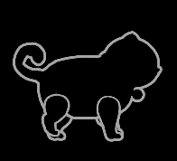

<p align="center"></p>

# RusK — Mod Loader (VED:Recure)

BepInEx 6 (IL2CPP) の上で動く、着脱可能な Mod ローダー。
ゲーム内メニュー (Insert キー) から Mod の機能を ON/OFF したり、Mod を読み込み・取り外し・再読み込みしたりできる。

- TabGUI / ClickGUI (Horion 風)、ArrayList・通知・ウォーターマーク
- Mod の着脱 (AssemblyLoadContext)、アクショントリガー、Config プロファイル
- Flex Window (Mod 用のドラッグ・リサイズできるウィンドウ)
- 同梱 Mod: **RusK UI** (ボタン HUD・攻撃予兆・キー追加) / **EXTREME Difficulty** (難易度 EXTREME の解放と敵の強化) / **Music Manager** (戦闘 BGM の置き換え) / **Camera View** (視点の切り替え) / **Party** (アクティブ3人・切り替えパリィ) / **Custom Model** (キャラの見た目を VRM に) / **Custom Item Model** (武器・装飾品の見た目を glb に)
- **RusK Check**: ゲームの更新で壊れた Mod を教える診断機能

**ゲーム**: [VED:Recure (Steam)](https://store.steampowered.com/app/3255500/Ved/)


**対応ゲームバージョン: 0.0.1876 (a46bc78)** — ゲーム画面の左下に出る `Version 0.0.1876_a46bc78` と同じか確認してください。
ゲームが更新されたときは、メニューの Mods > Check で動かなくなった Mod を確認できます。

## インストール (利用者向け)
1. [Releases](https://github.com/DonutSuZu/RusK/releases) から `RusK-Setup-vX.Y.Z.exe` をダウンロード
2. 実行して、画面の案内に従う (ゲームフォルダは Steam から自動検出。表示は日本語 / English / 中文)
   - BepInEx 6 (IL2CPP 版) が入っていなければ、動作確認済みの公式 be.788 をセットアップがダウンロードして一緒に入れる (SHA256 で確認)
   - セットアップには RusK 本体だけが入っていて、選んだ Mod は GitHub のリリースから最新版をダウンロードする
   - Mod の DLL だけ欲しいときは、各 Mod のリリース (例: Custom VRM Loader Mod) から落として `RusK\mods` に置く
3. ゲームを起動して **Insert** キーでメニューを開く

※ 署名していない exe なので、初回は SmartScreen の警告が出ることがある (「詳細情報」→「実行」)

## ライセンス
[LGPL-2.1](LICENSE)

---

以下は開発者向けの説明。

## 構成
```
RusK/
├─ RusK.API/            Mod が参照する公開API (IRuskMod, Module, Setting, Render)
├─ RusK.Core/           ローダー本体 (BepInExプラグイン)。Mod管理・GUI・Config
├─ RusK.Mods.Ui/        同梱Mod: ボタン HUD・攻撃予兆・キー追加 (バランスに影響しない補助)
├─ RusK.Mods.Extreme/   同梱Mod: 難易度 EXTREME
├─ RusK.Mods.Music/     同梱Mod: 戦闘 BGM の置き換え
├─ RusK.Mods.Camera/    同梱Mod: 視点の切り替え
├─ RusK.Mods.Party/     同梱Mod: アクティブ3人
├─ RusK.Mods.Model/     同梱Mod: キャラの見た目を VRM に (glb の読み込み・動きの写し・揺れ物・表情)
├─ RusK.Mods.ItemModel/ 同梱Mod: 武器・装飾品の見た目を glb に (glb の読み込みは RusK.Mods.Model/Vrm をソースごとリンク)
├─ RusK.Mods.Shared/    ゲーム用 Mod で共有するソース (キャラの表示名など。各 csproj に Compile Include でリンク)
├─ RusK.Installer/      配布用セットアップ (RusK-Setup.exe)
├─ RusK.sln
└─ build.bat            全体をビルドしてゲームへ配置

配置先 (ゲーム側):
  BepInEx/plugins/RusK/   RusK.Core.dll, RusK.API.dll   ← ローダー本体
  RusK/mods/              RuskUi.dll など              ← 着脱するMod
  RusK/configs/           <profile>.json                  ← 設定の保存先
  RusK/data/<modid>/      各Modの作業フォルダ
```

## 配布用セットアップ (RusK-Setup.exe) を作る
`release.bat` をダブルクリック → `dist\RusK-Setup-vX.Y.Z.exe` ができる（これ 1 つを配布すればよい）。
- `RusK.Installer` は .NET Framework 4.8 の WinForms アプリ（Windows 10/11 は追加インストール不要）
- ビルド時に RusK 本体と同梱 Mod を payload.zip にまとめて exe に埋め込む
- 利用者向けの説明は `RusK.Installer\Docs\README.txt`（インストール先の `RusK\README.txt` になる）
- BepInEx は同梱しない（未導入の人には公式ページへのリンクと、zip を選んで展開する機能を出す）

バージョンを上げるときに変える場所:
`RusK.Core\Rusk.cs` の `Version` / 各 `.csproj` の `<Version>` / `RusK.Installer\app.manifest` / `Docs\README.txt`

対応ゲームバージョンが変わったら: `RusK.Installer\InstallEngine.cs` の `SupportedGameVersion` / このファイルと `Docs\README.txt`（各 Mod の `GameVersion` は、その Mod を直したときだけ上げればよい。Check は版の違いだけでは注意を出さない）

Mod を増やしたら: `RusK.Installer\InstallEngine.cs` の `Components` (DLL の名前) と `RusK.Installer\Strings.cs` (説明の訳)

## リリースの分け方
- 本体: タグ `vX.Y.Z`「RusK vX.Y.Z」に `RusK-Setup-vX.Y.Z.exe` (セットアップには本体だけが入る)
- Mod: タグ `<Mod の ID>-vX.Y.Z` (例: `model-v1.2.5`「Custom VRM Loader Mod v1.2.5」) に DLL (例: `RuskModel.dll`)
- セットアップはリリースを新しい順に見て、Mod ごとにその DLL がある最初のリリースを最新として落とす。
  Mod だけ更新したいときは、その Mod のリリースを出すだけでよい (本体のリリースを「Latest」のままにするため `--latest=false`)

## 言語ファイル
- 各プロジェクトの `lang/translations.tsv` (元の文 / 英語 / 中国語) に訳を書き、`python tools/langgen.py <プロジェクト>` で
  `lang/ja.json`・`en.json`・`zh.json` を作る (訳の無い文は一覧に出て、tsv の最後に空欄で足される)
- json は DLL に埋め込まれる (`RusK.props`)。表示する文は `L.T("...")` で包む (モジュール名・説明・設定は本体が自動で訳す)

## ビルド
`build.bat` をダブルクリック。または:
```
dotnet build RusK.sln -c Release
```

## 操作
**Insert** でメニュー開閉（Visual > Menu > MenuKey で変更可）。メニューは2種類あり、Visual > Menu > GUI で切り替える。

### TabGUI（既定・キーボード操作）
画面左上に「カテゴリ → 項目 → 設定」の3列で出る。
| キー | 動作 |
|---|---|
| ↑ ↓ | 選択 |
| → / Enter | 開く・モジュール ON/OFF・コマンド実行 |
| ← / Backspace | 戻る |
| 設定の列で ← → | 値を変更（長押しでリピート） |
| 設定の列で Enter | キー割り当て開始・ボタン実行 |

### ClickGUI（マウス操作）
| 操作 | 動作 |
|---|---|
| 左クリック | ON/OFF・実行・設定を開く |
| 右クリック | 設定の開閉 / 値を戻す方向へ変更 |
| Shift+左クリック | モジュールのトグルキー割り当て |
| 見出しをドラッグ / 右クリック | パネル移動 / 折りたたみ |

### キー割り当て（共通）
「Bind」「Key」行を選んで Enter / クリック → 次に押したキーを割り当てる。
Ctrl / Shift / Alt を押しながらなら組み合わせキーになる。**Esc** でキャンセル、**Delete** で解除。

## メニューの中身
| カテゴリ | 内容 |
|---|---|
| Combat / Player / Visual … | 各 Mod のモジュール。先頭の「Bind」行でトグルキー、「ShowInList」で ArrayList に出すかを設定 |
| Visual > **Menu** | GUI の種類、MenuKey、透明度、カスタムカラー、ライティング（Static / Rainbow / Breathing / Wave）と速さ、ArrayList の表示とアニメ速度、ウォーターマーク、通知 |
| **Triggers** | アクショントリガーの編集。「+ Add Trigger」で追加 → Action（←→で選択）、Key、Mode（Press: 押すたび / Hold: 押している間）、Delete |
| **Mods** | Mod の Reload / Unload、未読み込み DLL の Load、Config プロファイル（切替・Save・Reload・New）、Rescan |

HUD: 右上 ArrayList（有効モジュール、ゆっくりスライド）、右下 ウォーターマーク（非表示可）と通知、
ボタン HUD（ゼンゼロと同じ並び: 攻撃・回避・スキル・ガード、ガードの上に追加攻撃。ゲージはボタンの中に液体がたまる見た目。
追加攻撃 = QTEAttack は、ガード・回避反撃・スキルの直後など撃てるときに光って READY! を出す）。

## 同梱 Mod の使い方
### Party（アクティブ3人）
- 拠点で **Party > Party > SelectMembers** から仲間を 2 人選ぶ（リーダーは拠点で選んだキャラ。戦闘中は編成を固定）
- 戦闘ステージに入ると仲間が控えに用意され、**C で次 / Z で前**のキャラに交代（クールタイム 3 秒）
- **切り替えパリィ**: 切り替えた瞬間を「ガードを押した」扱いにする。攻撃の直前に切り替えると、出てきたキャラがゲーム本来のガードでパリィする
- 操作中のキャラが倒れたら、生きている仲間に自動で交代（全員倒れたらゲームオーバー）
- 画面左にパーティ HUD（顔・HP・必殺技ゲージ・交代キー）。位置と大きさは設定で変更できる

### Custom Model（VRM）
- `RusK\models` に `.vrm` (VRM 0.x / 1.0) を置き、**Visual > CustomModel** でキャラごとに選ぶ
- ゲームのキャラ (骨格・アニメーション・当たり判定) はそのまま動かし、見た目だけを VRM にする
  - 動き: ゲームの骨の回転を、基準の姿勢 (T ポーズ) からの差分として毎フレーム VRM に写す
    (Unity の AvatarBuilder / HumanPoseHandler は IL2CPP 経由だとクラッシュするので使っていない)
  - 材質: ゲームのトゥーンシェーダー (Custom/ToonLit_Crt) で、ゲームのキャラと同じ陰影・色調で描く。
    透明部分はキャラ用の切り抜き (`_USEALPHACLIPPING_ON` + `_CharacterAlphaClipMap`、白い所が消える地図なので透明度を反転して渡す)。
    両面表示の材質は裏向きの面をメッシュに足し (Outline パスは止める)、影は裏向きの面の無い「影だけ」のメッシュで落とす
  - 揺れ物 (SpringBone) に対応。武器は VRM の手の位置に合わせる
  - 表情: ゲームの顔のブレンドシェイプ (Mouth_Shout = 口パク、Mouth_Smile02、Eyes_Closed、Pupil_* など) を VRM の表情 (A / Fun / Blink / LookUp など) に写す。ゲームの顔がまばたきしないときは自動のまばたき
  - 操作キャラだけでなく、タイトル画面・キャラクター画面・装備画面の見せるためのモデル (`CharacterShowController`) にも付ける。
    どのキャラかは `InitialSetting(id)` で受け取り、動きは `CinemachineBrain.LateUpdate` の後で写す (タイトル画面では CameraController が動かない)。
    元の体を描かないと Animator がアニメーションを止めるので、付けている間は `AnimatorCullingMode.AlwaysAnimate` にする
- 装飾品 (WeaponHolder_1～4: 頭・肩・腰・背中) は部位ごとに隠せる (`accessories.txt`、描画だけ止める)
- 設定は `RusK\data\model\assignments.txt`。ステージ移動などでキャラが作り直されても付け直す
- **Model > ModelLab** はデバッグ用 (モデルの作りの書き出し・キャラ同士の見た目の入れ替え・切り抜き方式の比較)

### Custom Item Model（武器・装飾品）
- `RusK\props` に `.glb` を置き、**Visual > CustomItemModel** で装備を選んでから glb を選ぶ。位置・回転・大きさ・発光を調整できる
- ゲームの武器・装飾品は、どれも装備 ID ごとの `Equip_<ID>` で、差し込み口 `WeaponHolder_0～4` に付く
  (武器は WeaponController 付きで、しまうとゲームの置き場に戻る。装飾品は WeaponHolder.m_equipGb から探す)。
  `Equip_<ID>` の下に glb を付け、元の見た目は `forceRenderingOff` で隠す
- 発光: glb の emissive (KHR_materials_emissive_strength 対応) と、画面の「光らせる」(色・強さ)
- 設定は `RusK\data\itemmodel\assignments.txt`

### Camera View（視点）
- **Visual > CameraView** の View で「近い肩越し / 真後ろ / 一人称 / カスタム」を選ぶ
- 一人称の目の高さはキャラごとに覚える。アクション `CycleView` をトリガーに割り当てると、キーで視点を順に切り替えられる

## RusK Check（Mod の診断）
メニューの **Mods > Check** で開く。ゲームの更新で壊れた Mod や、エラーが出ている Mod を教える。
- 読み込み時に Mod の全メソッドを JIT コンパイルさせ、**消えた / 形が変わったゲームの関数・型**を検出する
- `[HarmonyPatch]` のパッチ先が今のゲームに実在するかを確かめる
- モジュールの実行中のエラーや、OnLoad の失敗を Mod ごとに記録する
- ゲームの版 (`build_info.txt`) が前回から変わったら起動時に知らせる (上の検査で問題が無ければ「問題なし」として知らせる)
- Mod が動作確認した版と今のゲームの版が違うだけでは注意にしない。**上の検査で本当に壊れているものが見つかった Mod だけ**が ✗ になる
  (ゲームの更新のたびに全部の Mod を出し直さなくて済む。ただし、関数の形は同じで中身の動きだけが変わった場合は検出できない)

Mod 作者は、動作確認したゲームの版を書いておくと、Check の詳細に「確認済みゲーム」として表示される:
```csharp
[RuskMod("mymod", "My Mod", "1.0.0", GameVersion = "0.0.1873")]
```

## Flex Window（Mod 用ウィンドウ）
`RuskWindow` を継承して `Draw` に中身を書き、`Context.RegisterWindow(window)` で登録、`window.Visible = true` で開く。
ドラッグ・リサイズ・✕・スクロール・位置の保存・カーソル表示・クリックの貫通防止は RusK がやる。
```csharp
class MyWindow : RuskWindow
{
    float _hp = 100;
    public MyWindow() : base("main", "My Window", 400, 300) { }
    public override void Draw(WindowGui gui)
    {
        gui.Header("ステータス");
        _hp = gui.Number("hp", "HP", _hp, 10f);        // − 入力欄 +
        gui.BeginRow(1, 1);                              // 横並び
        if (gui.Button("回復")) { /* ... */ }
        if (gui.Button("閉じる")) Visible = false;
    }
}
```
部品: `Header` `Label` `Button` `Tabs` `Toggle` `Selectable` `Stepper`(◀▶) `Number`(直接入力可) `Slider` `BeginRow/EndRow` `Space` `Separator`。
色は `RuskStyle`（メニューのテーマ・ライティングと同じ色）を使う。

## Mod 同士の連携（RuskShared）
`RusK.API.RuskShared` は、Mod 同士で値をやり取りする共有の置き場。名前を付けて、どの Mod からも読み書きできる。
相手の Mod が入っていなくても動くように、読む側は既定値を渡す。名前は「Mod の ID.内容」の形にする。
```csharp
RuskShared.Set("camera.hideBody", true);                 // 書く (Camera View: 一人称で体を隠している)
bool hide = RuskShared.Get("camera.hideBody", false);    // 読む (Custom Model: VRM も隠す)
RuskShared.Changed += (key, value) => { /* 変わったとき */ };
```

## アクショントリガー
Mod は `Context.RegisterAction("名前", () => { ... }, "説明")` で 1 回きりの処理を登録できる。
登録したアクションと、各モジュールの ON/OFF がトリガーの発動先として選べる。
トリガーは Config プロファイルに保存される。

## 新しい Mod の作り方
1. `RusK.Mods.Extreme` をコピーして新プロジェクトにする（参照は `RusK.API` のみ）
2. `IRuskMod` を実装したクラスに `[RuskMod("id","名前","1.0.0")]` を付ける
3. `OnLoad` で `Context.RegisterModule(new YourModule())`
4. `Module` を継承して機能を書く:
   - `OnUpdate()` … 毎フレーム（有効な間）
   - `OnGUI()` … HUD 描画（`Render` を使う）
   - `OnEnable()/OnDisable()` … 切替時。Harmony パッチは `Context.Harmony.PatchAll(typeof(...))`
   - `AddSetting(new FloatSetting(...))` … ClickGUI に出る設定
   - モジュールを別の Mod に移したときは、コンストラクタで `MovedFrom("前のmodid:Name")` を呼ぶと、前の設定を引き継ぐ
   - `RuskInput.WasPressed(KeyCode.C)` / `RuskInput.WasPressed(hotkeySetting.Value)` … キー入力（メニュー操作中は自動で無視される）
5. ビルドして `RusK/mods/` に置く（`DeployDir` で自動配置）

## 着脱の仕組み（ハードコードしない設計）
- 各 Mod は独立した `AssemblyLoadContext` に読み込まれる
- DLL はメモリから読むのでゲーム起動中でも上書きできる（Reload 可能）
- アンロード時、RusK が自動で: モジュール登録解除 → `OnUnload()` → `Context.Harmony.UnpatchSelf()`
- **重要**: Mod 側では独自の MonoBehaviour を作らないこと。IL2CPP に登録した型は
  後から解放できないため。Update/描画は RusK が Module 経由で配る
- `Loader/CollectibleMods = true` にするとアセンブリ本体もメモリから解放を試みる（実験的）

## 設定の保存
- モジュールの ON/OFF・キー割当・設定値・パネル位置・テーマを `configs/<profile>.json` に保存
- メニューを閉じたとき、ゲーム終了時に自動保存
- アンロード中の Mod の設定も保持され、再ロードで復元される

## 見た目のカスタマイズ（今後の拡張ポイント）
色・サイズは `RusK.Core/UI/Theme.cs` に集約。`configs/<profile>.json` の `Theme` で
アクセント色・レインボー・不透明度・各HUDの表示切替ができる。
「カスタムライティング」やスキンを足すときはここを起点にする。
